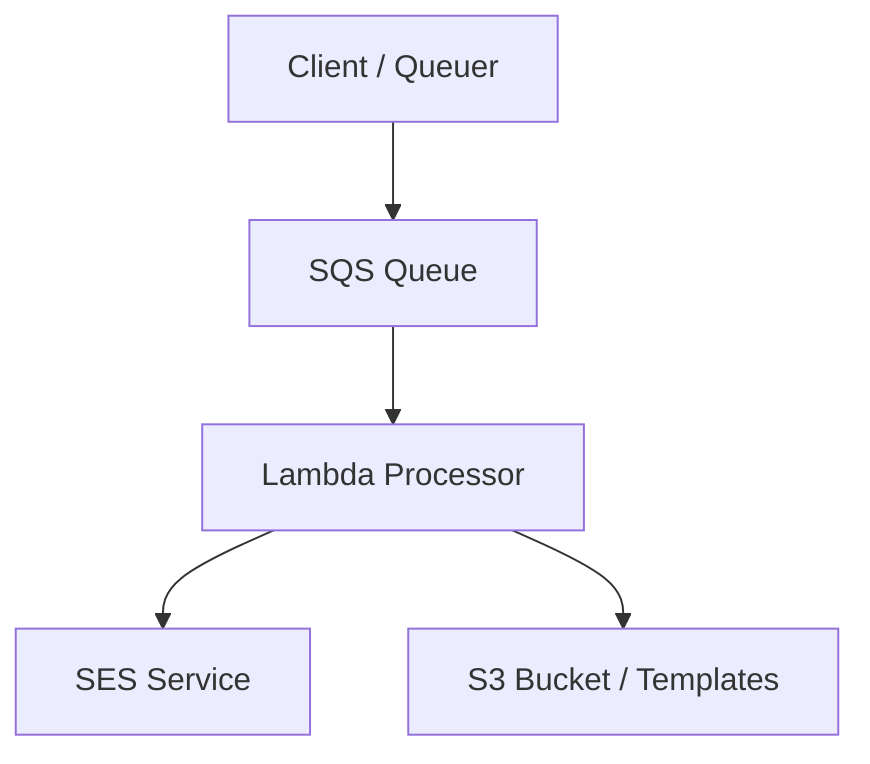

## How We Sent Millions of Emails in a Day Using Amazon Simple Email Service

Recently, I was tasked with architecting a solution to send a terms and conditions update notification to all of our users -- just under 5 million of them. This was a one-off bulk email send, but it needed to be done reliably and quickly. There was a business need to get this out in under 48 hours. That's a lot of emails to send in a short timeframe. To accomplish this, I leveraged Amazon Simple Email Service (SES) and a serverless event-driven pattern. 

### Preparation

Before we could send a single email, we needed to set up our domain for proper email authentication. I used OpenTofu to provision all the necessary DNS records for our new sending domain:

- **SPF records**: Authorizes SES to send on behalf of our domain
- **DKIM records**: Cryptographically signs emails to prove authenticity
- **DMARC records**: Tells receiving servers how to handle emails that fail authentication
- **MX records**: Required for authorizing the specific 'noreply' email inbox as well as bounce handling

Getting these records right is critical. Without proper authentication, your emails will land in spam folders or get rejected outright. Because the hosted zones are in Route 54, and defined using infrastructure as code, this made it easy to manage these records alongside the rest of our infrastructure, and we could version control the configuration. I have been playing around with Kiro, which acts as a force-multiplier for developer productivity, and by pasting in the records to create, it was able to do a lot of the heavy lifting of generating the HCL code for me.

Once that was done, I worked with AWS support to get our SES account out of sandbox mode and into production. After providing details of our needs and convincing them that we had a legitimate use cases, we were approved for a quota of 6 million emails per day with a send rate of 300 emails per second.

### The Architecture

Once SES was configured and we had production access, we needed a way to actually send emails at scale. The naive approach of calling the SES API directly from the CLI and iterating over a list of email addresses simply doesn't work at this volume. For starters, you'd have no way to handle failures gracefully, and you wouldn't be able to queue emails up faster than your rate limit, which means that you'd have to wait a very long time to submit the full list.

Instead, I built an event-driven architecture using SQS, Lambda, and S3:

The flow works like this:

1. A client script reads recipient data from a text file, one email per line and iterates over it, queuing messages to SQS
2. SQS triggers Lambda functions in parallel with batches of messages
3. Each Lambda invocation retrieves the premade email template from S3 (once per batch for efficiency).
4. Lambda sends emails concurrently
5. Successfully processed messages are automatically deleted from the queue. Failed messages land in the Dead Letter Queue (DLQ), and can be reattempted by "redriving" them.

### The Terraform Configuration

The infrastructure is defined entirely in Terraform. The SQS queue is configured with a visibility timeout matching the Lambda timeout (300 seconds) so that if a Lambda invocation fails, messages return to the queue for retry. I set message retention to 14 days, which ended up being far more than necessary.

The Lambda function runs Python with a 5-minute timeout and up to 1000 reserved concurrent executions. Environment variables configure the S3 bucket containing email templates, the template file key, the email subject line, and the source email address. An event source mapping connects SQS to Lambda, triggering the function with batches of 10 messages with a 1-second batching window.

The S3 bucket storing email templates is encrypted with a customer-managed KMS key, and the Lambda execution role follows least-privilege principles -- it can only read from the specific S3 bucket, decrypt with the KMS key, send emails via SES, and interact with its SQS queue.

### The Lambda Function

The Lambda function is a fairly straightforward Python script using the boto3 library to interact with AWS resources. It reads configuration from environment variables, retrieves the email template from S3 once for the entire batch, and then uses a `ThreadPoolExecutor` to send emails concurrently. Each SQS record contains a JSON body with the recipient's email address, which gets parsed and passed to the SES `send_email` API.

One important consideration when calling SES at scale is handling transient failures gracefully. I implemented the retry strategy described in the [AWS Builders' article on timeouts, retries, and backoff with jitter](https://aws.amazon.com/builders-library/timeouts-retries-and-backoff-with-jitter/). When an individual SES call fails, the function uses exponential backoff with jitter before retrying. The exponential backoff increases the wait time between retries to avoid hammering SES when it's under load, and the jitter adds randomness to spread out retry attempts and prevent the "thundering herd" problem where all failed requests retry at the same moment. This is especially important when you're sending millions of emails -- without jitter, correlated retries can create load spikes that make the problem worse.

### Queuing Recipients

To queue these recipients, I wrote a simple Python script that reads a recipient list from a local file provided as a command line argument and batches messages to SQS using `send_message_batch`. SQS allows up to 10 messages per batch, so the script sends them in groups of 10. This reduces the number of API calls to SQS. Each message body is just a JSON object containing the recipient's email address.

### Why This Pattern Works

This architecture has several key advantages:

- **Decoupling**: The queuing process is completely separate from the sending process. I was able to queue nearly 5 million recipients very quickly, and Lambda processed them as fast as our SES quota allowed.
- **Automatic scaling**: Lambda scales automatically based on queue depth. With 1000 reserved concurrent executions and batches of 10, we could theoretically process 10,000 emails simultaneously. This, however, was not feasible for us because AWS support would not increase our per-second send rate beyond 300 per second without a very large pool of 1,250 dedicated IP addresses. This would be prohibitively expensive, especially given the infrequent bursty nature of our email sending. 
- **Fault tolerance**: If a Lambda invocation fails, messages return to the queue after the visibility timeout and get retried automatically. After 3 failures, they arrive in the DLQ and can be redriven.
- **Cost effective**: You only pay for what you use. Lambda charges per invocation, SQS charges per message, and SES charges per email sent. This is far cheaper than maintaining dedicated infrastructure.

### Lessons Learned

A few things I learned from this exercise:

1. **Get your quota approved early**: The SES production access approval process can take a wihle. Don't wait until you need to send to request quota.
2. **Monitor your reputation**: SES provides a reputation dashboard. Watch your bounce and complaint rates closely. We, fortunately, only sent emails to a list of users we already had a relationship with, so our complaint rate was very close to zero, and even without a warm domain with established reputation, we had a very reasonable bounce rate.
4. **Test first**: I performed several test emails with small recipient lists before going to full volume. I started out with a handful of employees, then did the first 10,000 users to make sure it didn't fail before sending emails to the full recipient list.